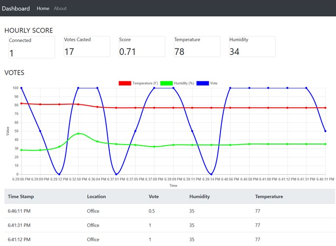

# Azure IoT Hands On Labs

## Overview

This hands-on lab demonstrates what is involved in connecting a physical custom device up to Azure IoT Hub, to both display the telemetry data sent from the device, but also demonstrate management of the device.  Additionally, we show you how to do simple "real time analytics" with Azure Stream Analytics and sending commands back to the device.

In this lab we will be building an application called Feedbox using Azure IoT services. Feedbox represents a user sentiment gathering solution which you might see in restaurants, airports, restrooms or any other location where you want to gauge user satisfaction.

It collects a user vote of Happy (1),  Neutral (.5) or Sad (0). As the users place their vote, we also collect location temperature and humidity. The votes are plotted on a graph and also displayed individually. In addition, an hourly score is calculated (the sum of the votes divided by the number of votes).

## Labs

* [Lab 1 - Creating the device](/labs/lab1.md)
* [Lab 1b - Using the device simulator](/labs/lab1b.md)
* [Lab 2 - Connect a device to IoT Hub](/labs/lab2.md)
* [Lab 3 - Create a real time dashboard](/labs/lab3.md)
* [Lab 4 - Gain real time insights](/labs/lab4.md)
* [Lab 5 - Communicating with the device](/labs/lab5.md)

## Prerequisite

    For the lab hardware, you need a Arduino Maker 1010 board a DHT22 temperature and humidity sensor, LED, resistors, breadboard, wires and three button.  If you don't already have hardware, you can buy the kits from the links below (among many other places). 

*	Arduino Maker 1010 - https://store.arduino.cc/usa/arduino-mkr-wifi-1010
*	DHT 22  Temperature and Humidity Sensor - https://www.adafruit.com/products/385
*   You can get a small kit that includes LEDs, resisters, breadboard etc from various places

* VS Code - https://code.visualstudio.com/
* Azure Functions Core Tools -https://github.com/Azure/azure-functions-core-tools (V2)
* A Windows machine to run the function app locally. If you have a Mac, you need to deploy the function app to Azure. This is due to the EvenHub binding needing the Azure Storage Emulator. 
* Access to an Azure subscription.